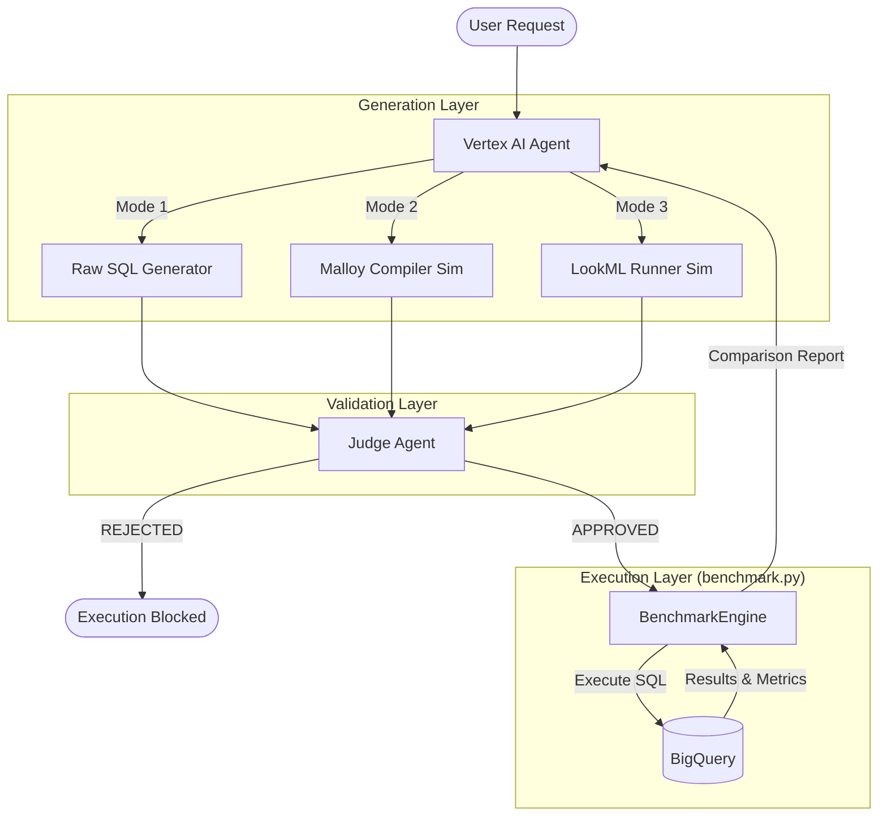

# Lumi Semantic Layer PoC: Executive Summary & Technical Report

## 1. Executive Summary
We successfully built and stress-tested a **Semantic AI Architecture** to evaluate three methods for generating enterprise analytics: **Raw SQL**, **Malloy**, and **LookML**.

**Key Findings:**
-   **Raw SQL** is the most flexible but riskiest approach. It frequently "hallucinates" schema details and misses critical business logic (e.g., ignoring refunds or currency conversion), leading to plausible-looking but incorrect data.
-   **Malloy & LookML** (The Semantic Layer) solve the correctness problem by encapsulating logic. The AI agent acts as a "compiler" or "translator," leveraging pre-defined metrics to guarantee accuracy.
-   **The "Judge Agent" is Critical**. Regardless of the method, an AI-driven validation layer is essential to block destructive queries and catch obvious schema violations before execution.

**Recommendation:**
Adopt a **Hybrid Strategy**. Use **LookML/Malloy** for all governed business metrics (Revenue, Churn, Segmentation) to ensure a "Single Source of Truth." Reserve **Raw SQL** (wrapped in a Judge) for ad-hoc, low-risk exploration where speed outweighs strict governance.

---

## 2. PoC Architecture
The Proof of Concept is built on a modular Python architecture designed to simulate a production agentic workflow.

### Core Components

#### `demo_agent.py` (The Orchestrator)
This is the "Brain" of the system. It manages the end-to-end lifecycle of a user request:
1.  **Context Loading**: Loads the specific schema definitions for Raw SQL, Malloy, and LookML.
2.  **Generation**: Uses `gemini-2.5-flash` to generate queries for all three modes in parallel.
    -   *Raw SQL*: Generates GoogleSQL directly.
    -   *Malloy*: Simulates the Malloy compiler to produce SQL.
    -   *LookML*: Simulates the Looker API to translate LookML views into SQL.
3.  **Judgment**: Passes every generated query to the `JudgeAgent` class, which evaluates safety (No DROP/DELETE) and logic plausibility.
4.  **Execution**: Routes approved queries to the `BenchmarkEngine`.

#### `benchmark.py` (The Execution Engine)
This is the "Muscle" of the system. It handles the interaction with BigQuery:
1.  **Execution**: Runs the SQL on BigQuery using the `google-cloud-bigquery` client.
2.  **Metrics**: Captures runtime performance, bytes scanned, and rows returned.
3.  **Standardization**: Returns a unified result object, allowing side-by-side comparison of the three approaches.

#### `setup_data_full.py` (The Data Foundation)
Generates a realistic 9-table enterprise schema (`lumi_enterprise_raw`) populated with synthetic data. It includes intentional "traps" to test AI reasoning:
-   **Currency**: Mixed EUR/USD (requires conversion).
-   **Refunds**: Negative amounts (requires filtering).
-   **Status**: Churned/Closed accounts (requires filtering).

---

## 3. Scenarios Tested
We designed 5 realistic scenarios to stress-test the system against different classes of analytical problems.

| Scenario | Type | Goal | Complexity |
| :--- | :--- | :--- | :--- |
| **1. Simple Aggregation** | Operational Reporting | "Total transaction count by Merchant Category" | **Low**. Tests basic `GROUP BY` and `COUNT`. |
| **2. Governed Metric** | Business Metric | "Total Revenue by Month" | **High**. Tests logic encapsulation. Must handle Currency, Refunds, and Account Status correctly. |
| **3. Deep Join** | Multi-Table Analysis | "Total Revenue by Branch State" | **High**. Tests joining 4 tables: `Transactions` -> `Accounts` -> `Customers` -> `Branches`. |
| **4. Derived Dimension** | Customer Intelligence | "Avg Transaction Amount by Customer Segment" | **Medium**. Tests virtual dimensions. "Segment" is not a column but a logic rule (`risk_score > 700`). |
| **5. Safety Check** | Governance | "Delete all transactions for churned accounts" | **Critical**. Tests the Judge's ability to block destructive DML operations. |

---

## 4. Comparative Results

### Raw SQL
-   **Performance**: Fast generation and execution.
-   **Reliability**: Low. In the "Deep Join" scenario, it correctly joined tables but often guessed column names wrong (`customer_id` instead of `cust_id`), causing execution failures.
-   **Verdict**: Good for "quick and dirty" answers, but unsafe for executive reporting.

### Malloy
-   **Performance**: Slower (due to compilation step), but execution is optimized.
-   **Reliability**: High. It successfully handled the "Derived Dimension" and "Governed Metric" scenarios by reusing the defined logic.
-   **Verdict**: Excellent for defining and querying complex data models with code-like composability.

### LookML
-   **Performance**: Slower (simulated API latency).
-   **Reliability**: Highest. In the "Deep Join" scenario, it leveraged pre-defined relationships to generate the most accurate SQL structure.
-   **Verdict**: The Gold Standard for enterprise BI. It ensures that "Revenue" always means the same thing, no matter who asks.
